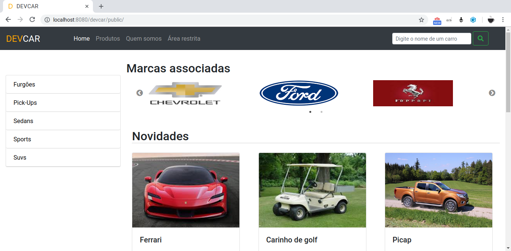
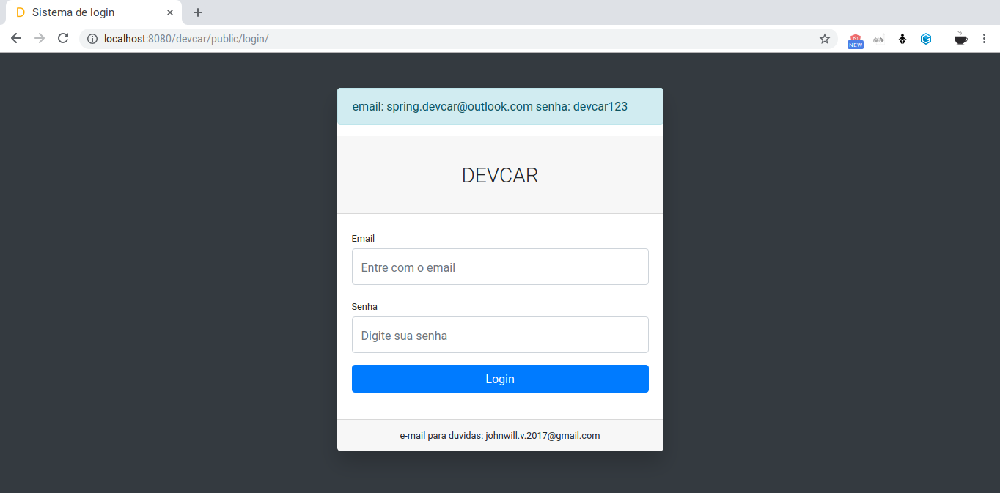
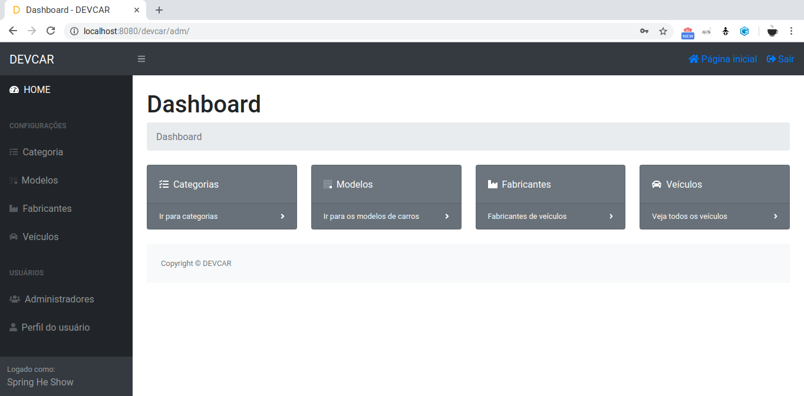
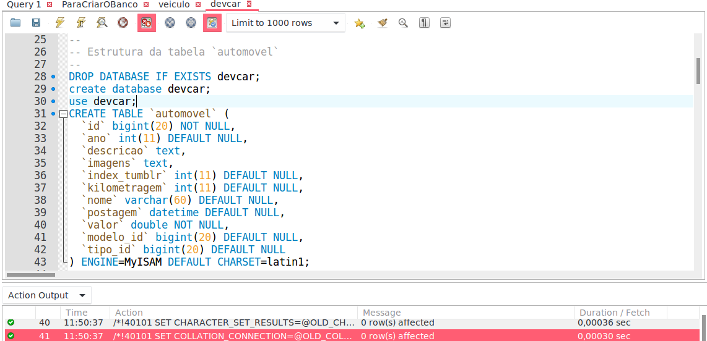
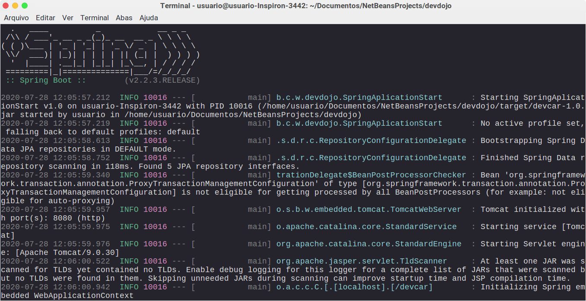

#  Exame Chunnin

## O que é
<p>
    O exame chunnin é um projeto web que simula uma vitrine de carros. Nele é possível gerenciar dados de veículos,
    além de expo-los ao usuário comum do sistema. O sistema possibilita você fazer buscas e consultar fichas técnicas
    dos carros cadastrados.
</p>

## Como foi feito

<p>
    Esse projeto utiliza da tecnologia do spring boot, spring MVC e de algumas especificações do JavaEE, são elas:

<ul>
    <li><strong>JSP</strong> para camada de view;</li>
    <li>JPA com hibernate, claro com um toque majestoso do  Spring Data ;).</li>
</ul>
</p>

<p>
    A ideia do sistema basicamente se consiste em dar acesso aos seguintes usuários:
<ul>
    <li><strong>Usuário comum</strong>: esse poderá ver as vitrines com os automóveis, pesquisar
        carros a partir do nome e consulta-los por categoria;</li>
    <li><strong>Usuário administrativo</strong>: esse poderá fazer tudo que o comum faz, mas também  gerenciar o sistema.
        Ele poderá manter carros, fabricantes, modelos e categorias, isso tudo permite ele ter controle das informações
        que o sistema traz com sigo.</li>

</ul>
</p>

<p>
    A aplicação utiliza do sistema de arquivos do SO para salvar imagens e do banco de dados
    mysql para persistir dados das entidades que o compõem.
</p>

## Algumas fotos do sistema

 
 
 


## Como executar

### Criar a database
<p>
    O primeiro passo é criar a database no banco de dados mysql, para isso é só executar o script sql do arquivo devcar.sql. Você pode abrir o arquivo no workBench e executálo através dele. 
</p>



### Compilar o programa
<p>O jeito mais fácil do mundo é você abrir o projeto em uma IDE como NetBeans, eclipse, IntelliJ, entre outras. Também é necessário ter o <strong> maven </strong> instalado.</p>

<p>
    Se você quiser executar através da linha de comando, particularmente acho mais simples, deverá compilar o projeto através da seguinte linha no terminal:
</p>

```bash
$ mvn clean install
```

### Executar ou na IDE ou no terminal
<p>Caso você use uma IDE ela já possui uma interface que te permite a execução da aplicação  de uma forma simples.
</p>
<p>
    Para rodar a aplicação no terminal basta executar o jar dentro da pasta target. Muitas aplicações são empacotadas como war, mas ao fazer isso não consegui atrelar ao meu tomcat e essa parte não vingou, mas a execução a partir de um jar se torna bem mais fácil do que o processo de um war :).

```bash
$ java -jar target/devcar-1.0.jar  
```
</p>

<p>
    Depois de todo esse processo essa linda tela irá aparecer:
</p>




<p>
    Ufa !
</p>

<p>
    Depois disso é só abrir o navegador e entrar na seguinte url:
    <a href="http://localhost:8080/devcar/public/">
    http://localhost:8080/devcar/public/
    </a>
</p>

## Fim

<p>
    Então esse é o projeto e foi feito com muito carinho, talvez sem um pouco de imaginação mas detalhes ... Se você encontrou algum erro ou viu que o meu código pode ser melhorado não hesite em me mandar um e-mail :

    johnwill.v.2017@gmail.com
</p>


